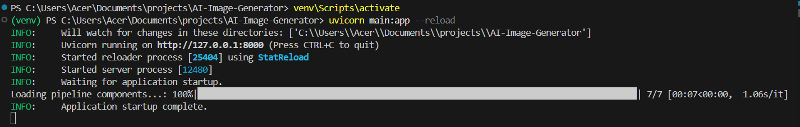
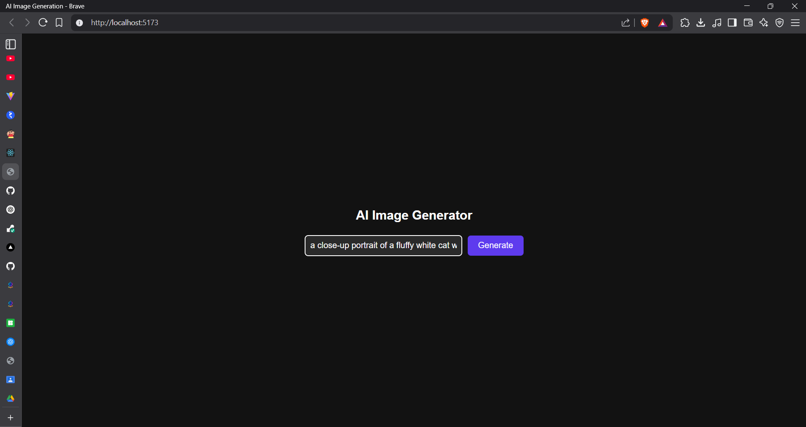
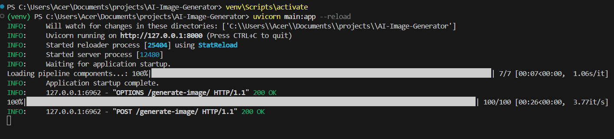
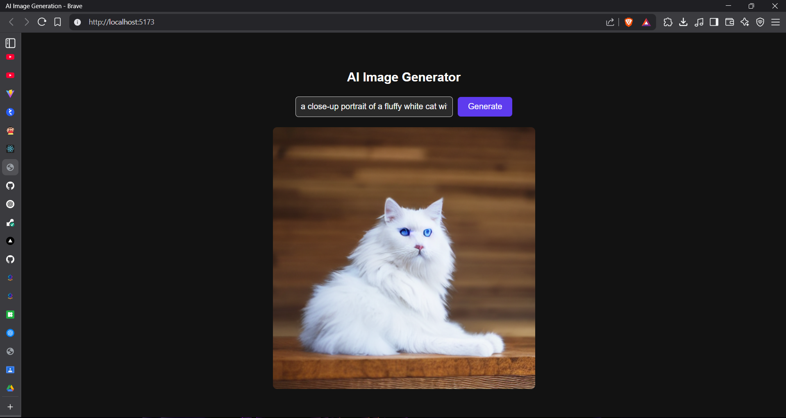

# 🧠 AI Image Generation with RTX Acceleration 🎨

This project lets you generate high-quality AI images using your **own GPU (e.g., RTX 3050)** via a local **Stable Diffusion backend** powered by FastAPI + Diffusers, and a beautiful React + Vite frontend.

---

## ✨ Features

- 🔥 GPU-accelerated image generation (via PyTorch + CUDA)
- 🎨 React frontend with prompt input and live preview
- ⚡ Powered by [HuggingFace Diffusers](https://huggingface.co/docs/diffusers)
- 📡 Frontend-backend communication via FastAPI and REST
- 🌗 Clean light/dark mode-friendly UI (optional)

---

## 📦 Folder Structure

```
AI-IMAGE-GENERATION
├── ai-image-frontend/      # React frontend (Vite)
│   ├── src/components/
│   │   └── ImageGenerator.jsx/css
│   └── .env                # API URL
├── main.py                 # FastAPI backend w/ Stable Diffusion
├── venv/                   # Python virtual environment (excluded)
├── generated_image.png     # Output (optional)
└── .env                    # Backend config (model, CORS)
```

---

## ⚙️ Backend Setup (FastAPI)

### 1. Create a Python venv
```bash
python -m venv venv
source venv/bin/activate   # or venv\Scripts\activate on Windows
```

### 2. Install dependencies
```bash
pip install -r requirements.txt
```
If you don’t have `requirements.txt`, install manually:
```bash
pip install fastapi uvicorn diffusers transformers torch torchvision python-dotenv
```

### 3. Create `.env` file (backend)
```env
FRONTEND_ORIGIN=http://localhost:5173
SD_MODEL_ID=runwayml/stable-diffusion-v1-5
```

### 4. Run backend
```bash
uvicorn main:app --reload
```

Backend will run at: [http://127.0.0.1:8000](http://127.0.0.1:8000)

---

## 🧑‍🎨 Frontend Setup (Vite + React)

```bash
cd ai-image-frontend
npm install
```

Create `.env` inside `ai-image-frontend`:
```env
VITE_API_URL=http://127.0.0.1:8000
```

Run frontend:
```bash
npm run dev
```
Open: [http://localhost:5173](http://localhost:5173)

---

## 🔐 Do Not Commit These!

Make sure you **add this to `.gitignore`**:
```gitignore
.env
venv/
__pycache__/
node_modules/
generated_image.png
```

---

## 🧪 Test GPU
If you want to confirm PyTorch is using your GPU:
```python
import torch
print(torch.cuda.is_available())  # Should be True
print(torch.cuda.get_device_name())
```

---

## 📸 Screenshot

### 🟢 1. Backend Started Successfully
Backend running with Stable Diffusion model loaded.



---

### 🟣 2. Prompt Entered in Frontend
User enters a creative prompt like:
`a close-up portrait of a fluffy white cat with blue eyes, high-resolution, 4k`



---

### ⏳ 3. Image is Generating...
Frontend loading state while backend processes the image.



---

### 🖼️ 4. Final Image Displayed
The generated image is displayed after the request completes.



---

## 📄 License
MIT — use it freely, modify it proudly.

---

## 🙌 Acknowledgements
- [Hugging Face](https://huggingface.co/)
- [Diffusers](https://github.com/huggingface/diffusers)
- [FastAPI](https://fastapi.tiangolo.com)
- [React + Vite](https://vitejs.dev)

---

Built with ❤️ by [@Viole07](https://github.com/Viole07)
